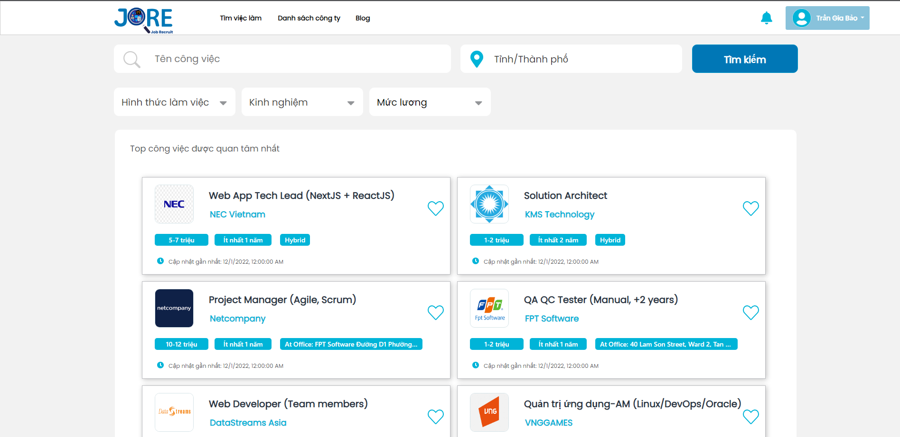

# Job_Hiring_Web

This is a job search and recruitment website aims to create a bridge between employers and job seekers..

## Deployed websites

- Admin: https://admin-jore.onrender.com
- Employer: https://employers-jore.onrender.com
- Candidate: https://jore.onrender.com/candidate

## Running the project locally

### `npm run start`

## Features

- General features:
  - Registering, Logging with authentication.
  - Forgot password.
- Admin's features:
  - Managing users' accounts.
  - Managing recruitment posts.
  - Managing recruitment reports from candidates.
- Employer's features:
  - Managing profile.
  - Managing recruitment posts.
  - Managing candidates' CV.
- Candidate's features:
  - Managing profile.
  - Reporting recruitment posts.
  - Viewing employers' profile.
  - Searching and filtering recruitment posts.
  - Reviewing employers.
  - Registering form to provide some main information and upload CV file when applying for a job.
  - Managing the list of submitted CVs.

## Technical Documents

- Meeting and assigning tasks: Slack & Trello.
- Design: Figma.
- BE & FE: Node.js with Handlebars in the MVC Model.
- Database: Firebase.
- Deployment: https://render.com/

## Contributors

- [Trần Gia Bảo](https://github.com/trangiabao2702/)
- [Dương Minh Hiếu](https://github.com/duongminhhieu).
- [Hồ Duy Bảo](https://github.com/hoduybao).
- [Lê Phước Đôn](https://github.com/lephuocdon).
- [Hồ Xuân Quang](https://github.com/hxq2730).
